# ROS2 3일차 과제 보고서 #

## 1. 동작 원리
### 1.1 lifecycle 상태 머신
```
Unconfigured --configure--> Inactive --activate--> Active
     ^                          ^                     |
     |                          |------deactivate-----|
     |--------cleanup-----------|
```
### 1.2 fake_imu
+ 파라미터 : rate_hz(발행 주기), stamp_offset_sec(발행 시각보다 스탬프를 몇 초 전으로 찍을 지 정한다.)
+ on_activate에서 1.0 / rate_hz 주기 타이머 생성
+ 매 틱마다 스탬프를 만든다.
### 1.3 imu_watchdog
+ 파라미터 : timeout_sec, check_rate_hz 둘 중 하나라도 0 이하면 on_configure에서 FAILURE로 반환해서 다음단계로 못넘어가게 막는다. (rate_hz <= 0으로 하면 오류가 발생함)
+ /imu를 일반 Subscription으로 구독한다. 구독은 lifecycle 상태를 자동으로 따르지는 않느다. 그래서 watchdog가 inactive여도 데이터는 계속 들어와서 last_msg_에 저장되고 그걸 쓸지 말지 직접 걸러줘야한다.
+ on_activate에서 1.0 / check_rate_hz 주기로 check_age()를 돈다.
+ 상태 3가지 (NO_DATA / FRESH / STALE)를 계산해두고, 바로 직전 상태랑 비교해서 달라졌을 경우 [NO DATA] / [STALE] / [RECOVERD]를 찍는다.
+ FRESG일 때는 매 틱마다 /imu_checked로 재발행한다.

  
 ## 체크포인트
 ### 체크포인트 1
 + Active 일때만 rate_hz 대로 발행하고, deactive면 중단한다. 
 + 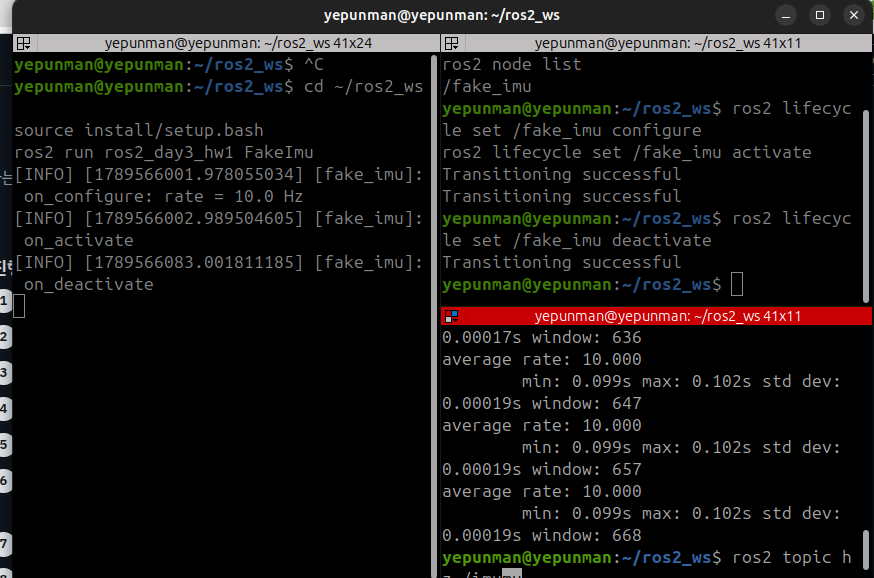
 ### 체크포인트 2
 + timeout_sec / check_rate_hz가 음수일 경우 FAILURE를 반환하고, unconfigured 상태를 유지한다.
 + [ERROR] timeout_sec must be > 0 (got -1.00)
 !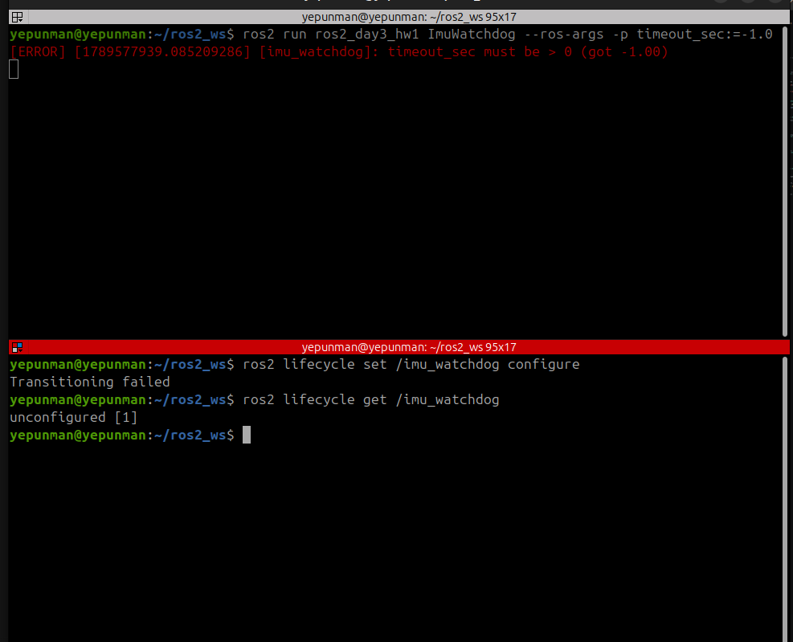
 + [ERROR] check_rate_hz must be > 0 (got -1.00)
 + 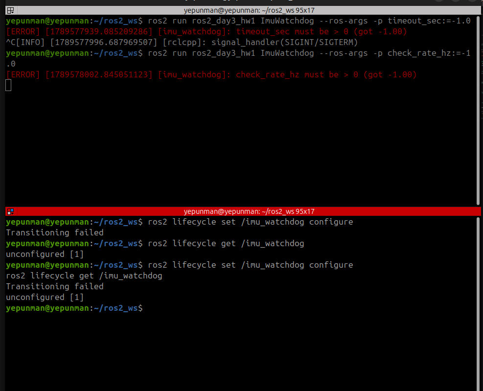
 ### 체크포인트 3
 + offset을 0으로 맞춘 뒤 [RECOVERD] + /imu_checked가 5Hz로 안정적으로 출력되는 지 확인한다.
 + ros2 topic hz /imu_checked → average rate: 5.000
 +  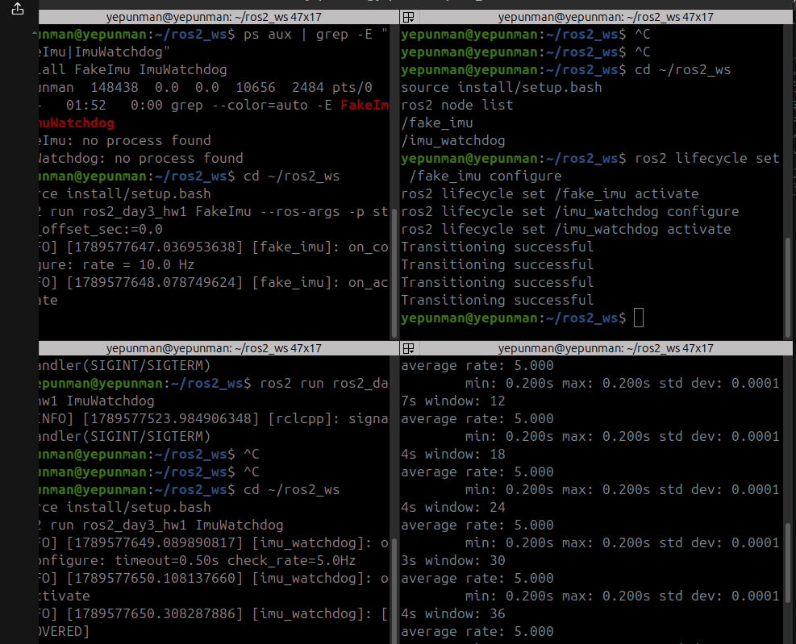
 ### 체크포인트 4
 + 고장 재현(deactivate/offset 상향) 두 방식 모두 [STABLE]을 정상적으로 감지하고 /imu_checked 재발행을 중단한걸 확인한다.
 +  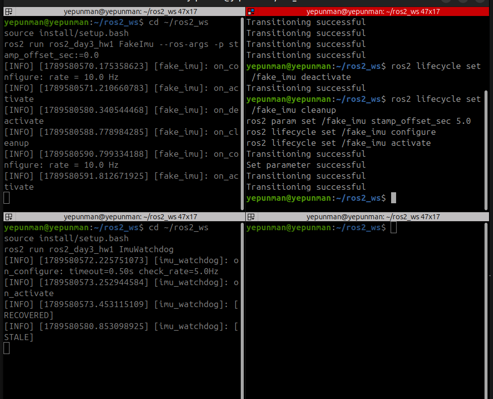

 +  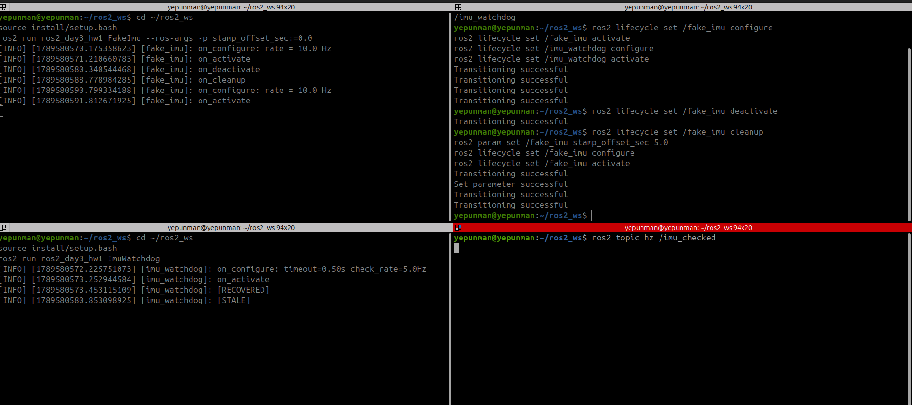
 ### 체크포인트 5
 + day_gap_bag_v3에 정상구조로 녹화하고, ros2 bag info로 duration 및 메세지 수를 검증한다.
 + 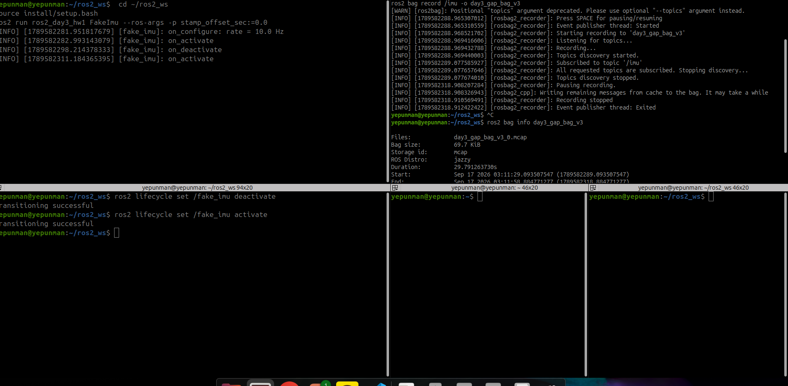

 ### 체크포인트 6
 + 일시정지 동안에는 출력하지 않고, bag 재생 진행에 맞춰서만 [STALE] / [RECOVERD]가 반응한다. --rate 2.0 에서는 공백 구간이 2배정도 감속한다.
 + 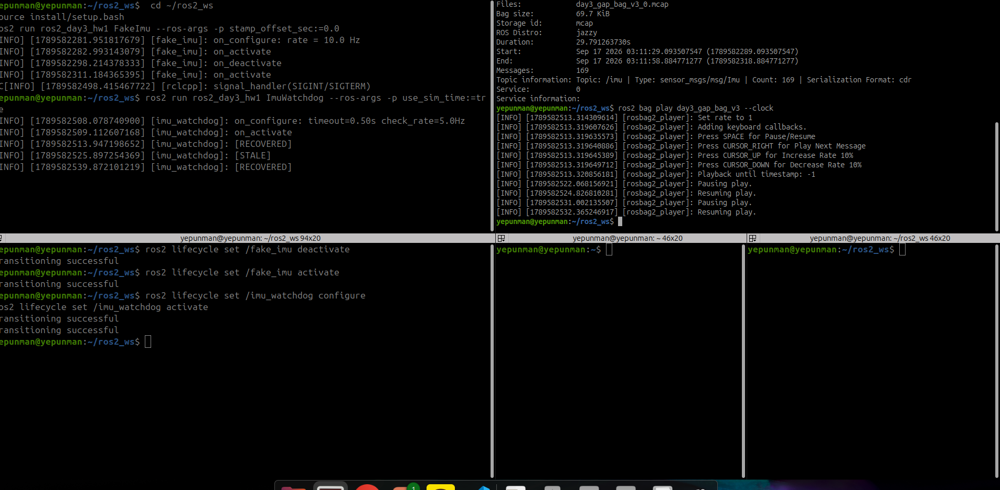
 + 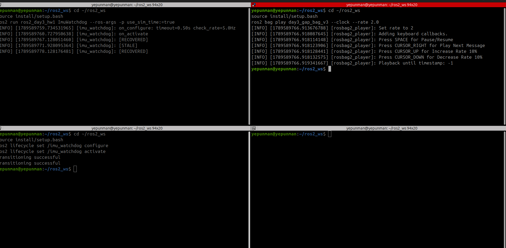
 ### 체크포인트 7
 + 최종 상태 판정 결과는 같다. 하지만 일시정지 주에서도 check_age()가 계속 호출되는 것을 tick 로그를 통해 확인 할 수 있다.
 + 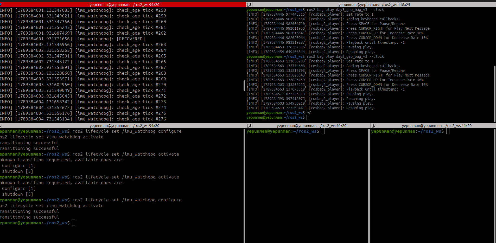
 ### 체크포인트 8
 + bringup.launch.py 한번으로 fake_imu, imu_watchdog 모두 active 할 수 있다. /imu_checked도 정상 발행되는 것을 확인 할 수 있다.
 + 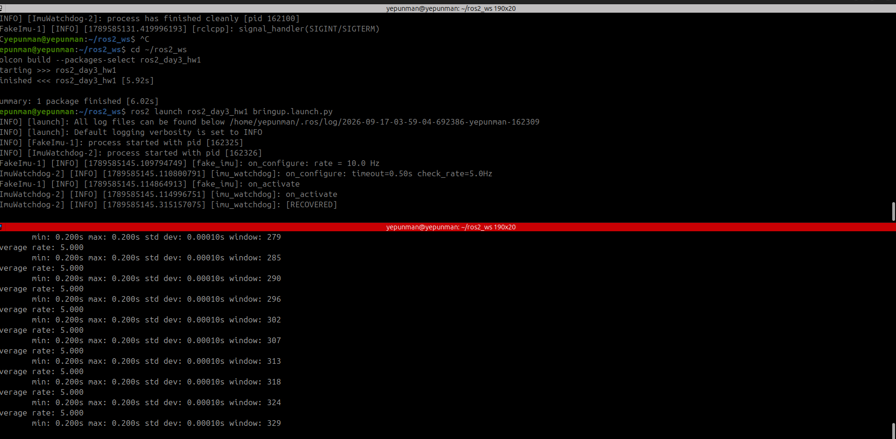