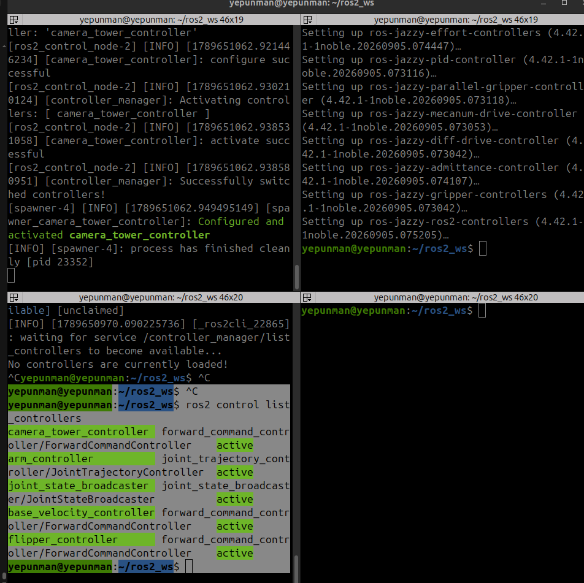

# ros2_day4_hw2_report

## CP1 
+ 	launch 한 번으로 bringup 실행, 모든 컨트롤러 active
+ 	
+ 	왼쪽 아래 터미널을 보면 모든 컨트롤러가 active인 것을 확인할 수 있다.

## CP2
+ 카메라 타워 관절 4개에 명령을 보내 움직이기
+ <video src="ros2_day4_hw2_2.webm" controls width="100%"></video>

## CP3
+ 팔 관절 6개를 컨트롤러 하나로 궤적 명령을 보내 움직이기
+ <video src="ros2_day4_hw2_3.webm" controls width="100%"></video>

## CP4
+ 베이스의 바퀴와 플리퍼에 명령을 보내 움직이기
+ <video src="ros2_day4_hw2_4.webm" controls width="100%"></video>
