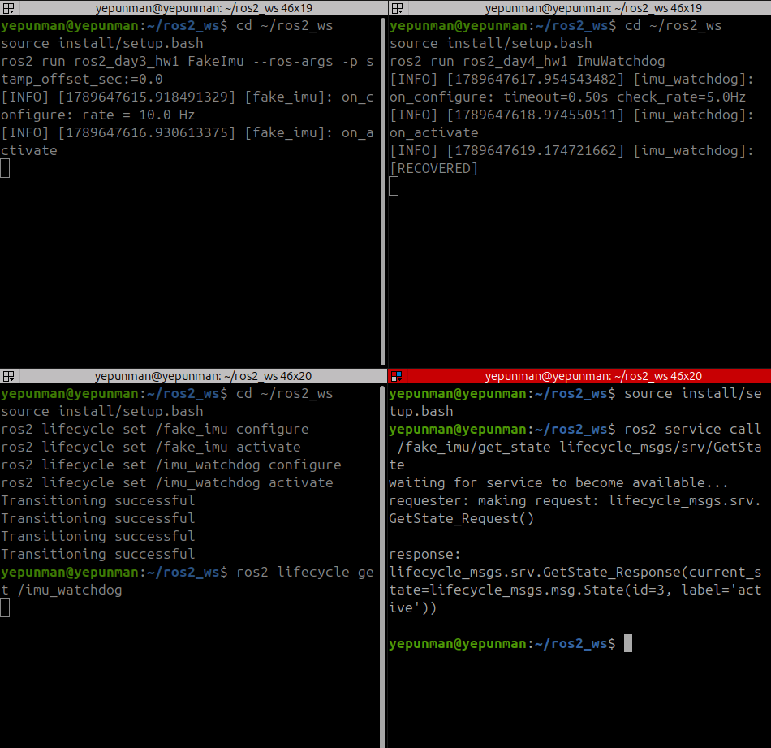
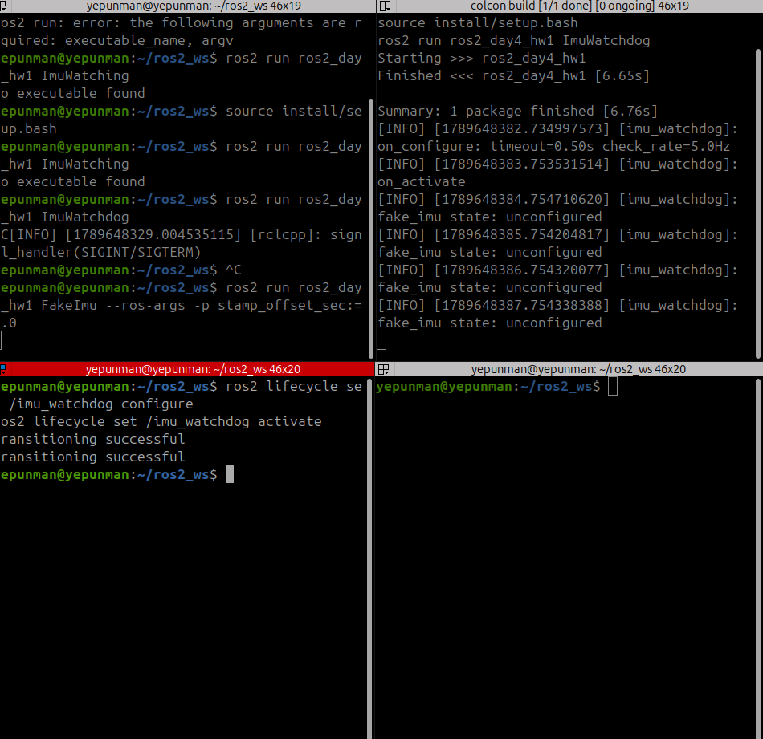
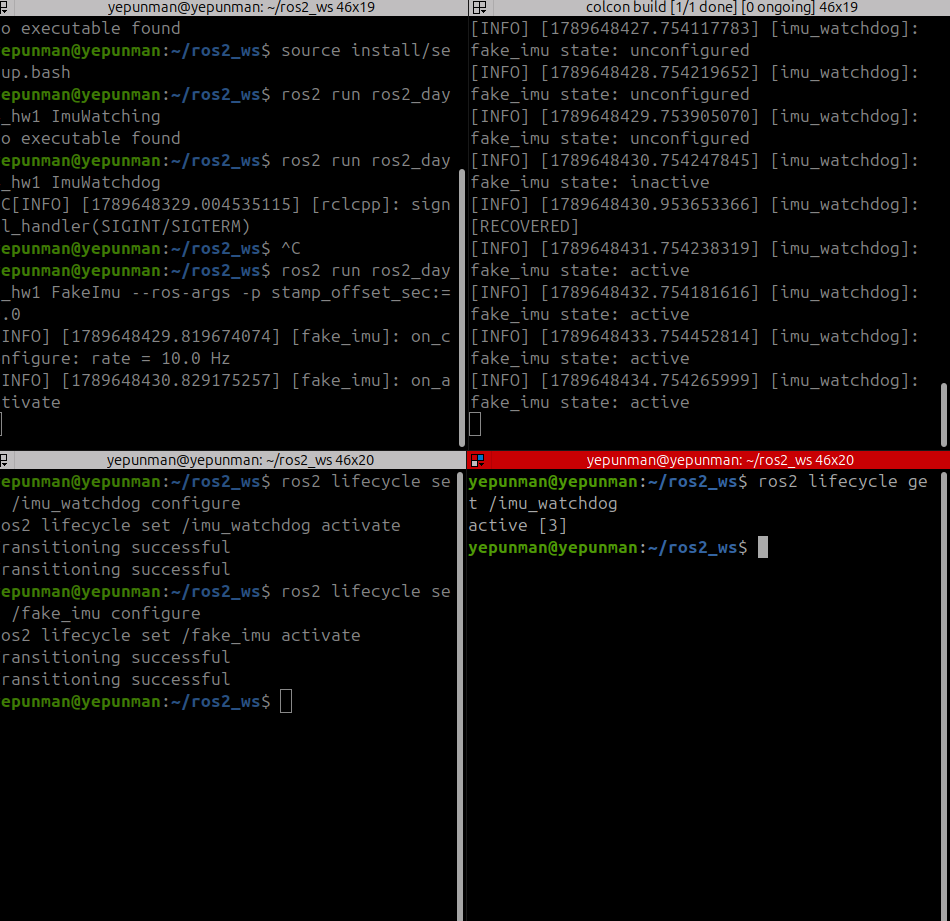
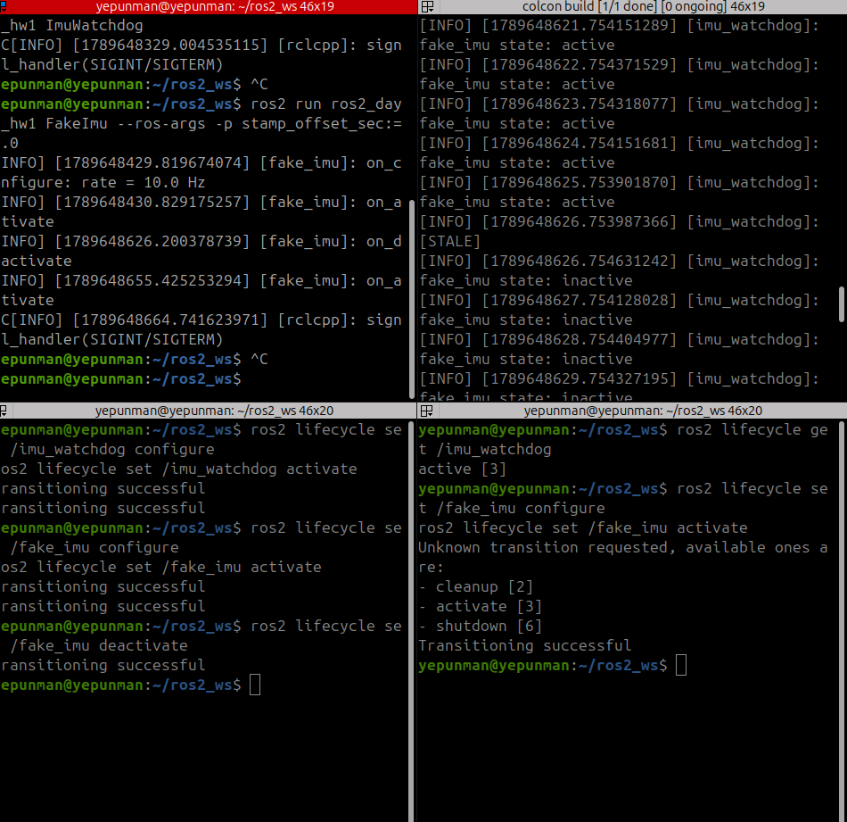
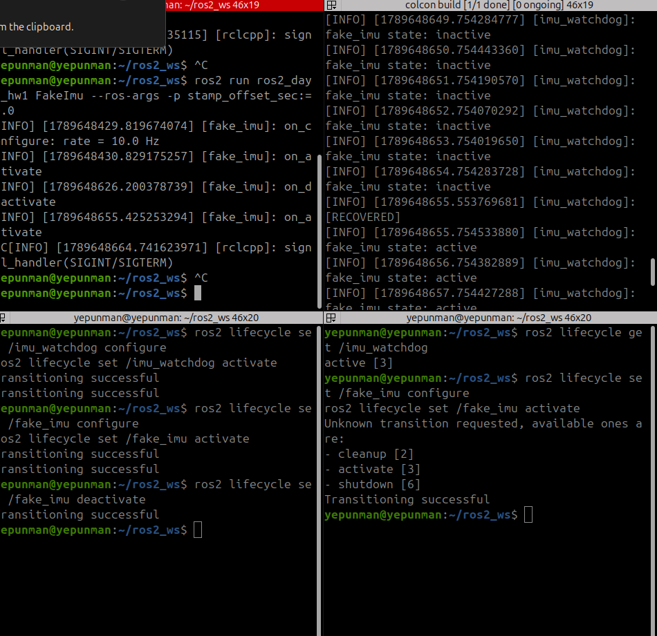
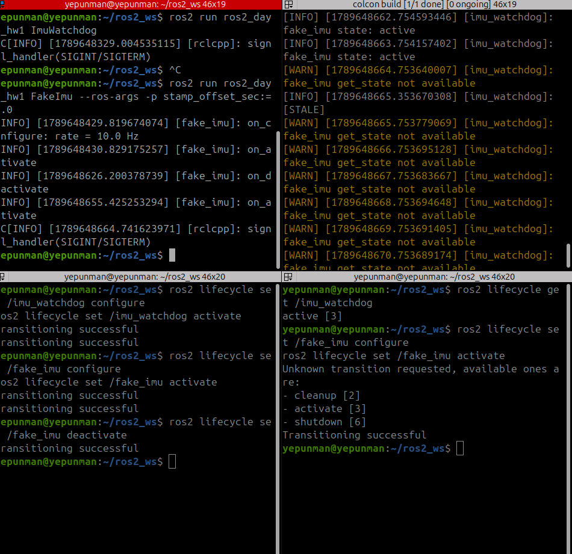

# ROS2_day4_hw1_report

## 1단계
+ 타이머 콜백 안에서 응답을 기다리는 방식으로 구현. 상태 로그, age 검사 로그, ros2 lifecycle get /imu_watchdog, ros2 service call /fake_imu/get_state 결과를 관찰해 기록한다.

+ ros2 lifecycle get /imu_watchdog 를 실행하면 응답 없음을 확인 할 수 있고, ros2 service call /fake_imu/get_state lifecycle_msgs/srv/GetState을 실행하면 다시 active로 정상적으로 응답하는 것을 확인 할 수 있다.

## 2단계
+ 비동기 호출 + 응답 콜백으로 수정. 상태 로그가 1초마다 나오고 age 검사도 정상인지 확인
+ 
+ 
+ watchdog에서 fake_imu state: unconfigured가 1초 간격으로 계속 찍히는데 ros2 lifecycle get /imu_watchdog을 다른 터미널에서 실행시키면 active[3]으로 응답하는 것을 확인할 수 있다.
+ 그리고 fake_imu도 configure/activate 를 보내자 마자 fake_imu state가 uconfigured -> inactive -> active로 순서대로 바뀌는 것을 확인 할 수 있다.

## 3단계
+ fake_imu를 deactivate → cleanup → configure → activate, 마지막에 종료. 로그가 상태를 따라가는지 확인
 
+ 
+ 
+ [STABLE] , state : inactive -> [RECOVERD] , state : active -> [WARN] -> [STABLE]이 나오는 것을 확인 할 수 있다.